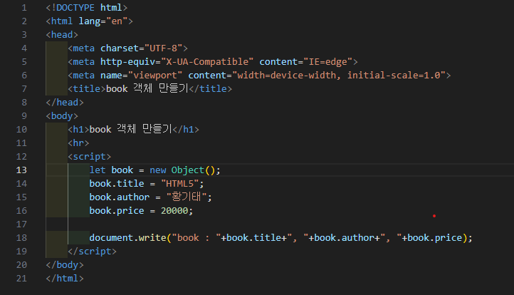
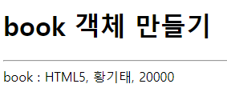
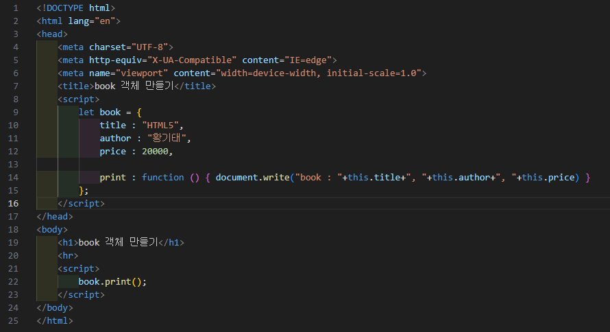
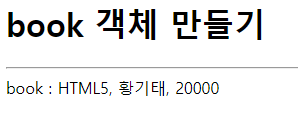
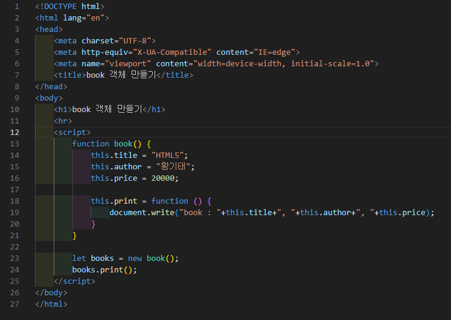
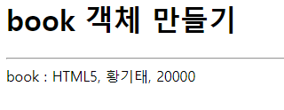

# 347페이지 실습문제 9번 문제

-----------------------------

## 9-1번 문제

-----------------------------

### 웹페이지의 구성

> 문제에서 요구하는 웹페이지는 다음 조건을 만족해야합니다.

+ new Object()를 이용하여 book 객체를 작성하고 객체를 출력

### new Object()를 이용하여 객체 생성 및 출력

-----------------------------

> new Object()를 이용하여 book이라는 객체를 생성하고, title, author, price의 프로퍼티를 생성하여 값을 설정한 후, 각 프로퍼티에 접근하여 출력합니다.

### 완성된 웹페이지와 코드

-----------------------------

> 다음은 완성된 웹페이지 사진과 코드 사진입니다.

## 9-2번 문제

-----------------------------

### 웹페이지의 구성

> 문제에서 요구하는 웹페이지는 다음 조건을 만족해야합니다.

+ 리터럴 표기법으로 book 객체를 작성하고 객체를 출력

### 리터럴 표기법으로 객체 생성 및 출력

-----------------------------

> 리터럴 표기법으로 객체를 생성해야하므로, book 변수에 중괄호를 통해 프로퍼티들을 생성 및 초기화해주고, 메소드를 작성해줍니다.
> 해당 book 객체에 접근하여 값들을 출력합니다.

### 완성된 웹페이지와 코드

-----------------------------

> 다음은 완성된 웹페이지 사진과 코드 사진입니다.

## 9-3번 문제

-----------------------------

### 웹페이지의 구성

> 문제에서 요구하는 웹페이지는 다음 조건을 만족해야합니다.

+ 프로토타입 book을 작성하고 book 객체를 출력

### 프로토타입 book 객체 생성 및 출력

-----------------------------

> 프로토타입으로 book 객체를 생성해야하므로, 함수로 book 객체를 작성합니다.
> this를 이용하여 프로퍼티를 생성 및 초기화 해주고, 메소드를 작성해줍니다.
> book 객체를 생성하여 각 프로퍼티값들을 출력해줍니다.

### 완성된 웹페이지와 코드

-----------------------------

> 다음은 완성된 웹페이지 사진과 코드 사진입니다.

