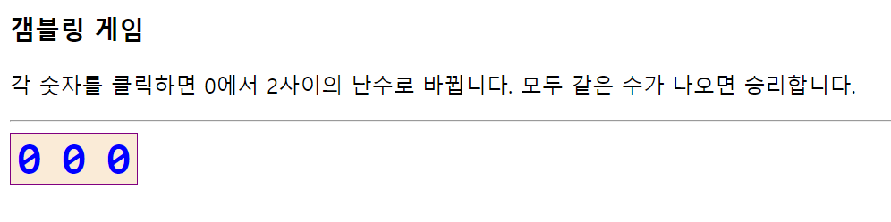
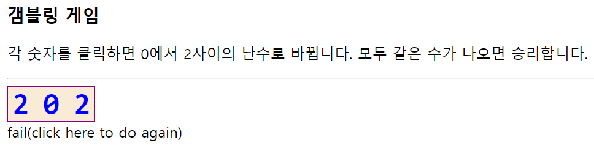
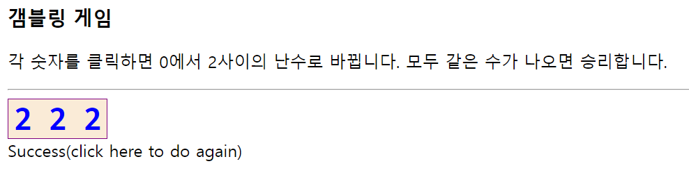
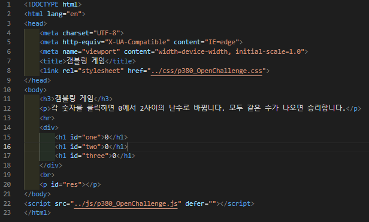
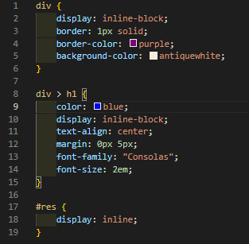
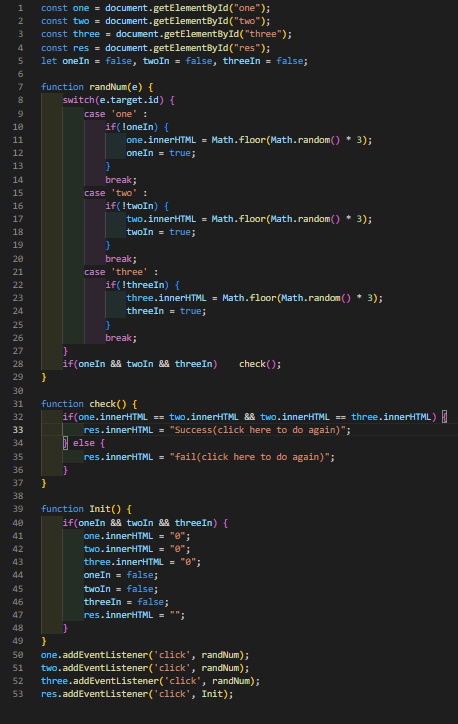

# 380 페이지 OpenChallenge 08번 문제

-----------------------------

## 웹페이지의 구성

> 문제에서 제시한 조건은 다음과 같습니다.

+ 숫자 클릭 시 0 ~ 2 사이 랜덤값 출력
+ 마지막 숫자 클릭 후 숫자 검사로 모두 같으면 성공, 아니면 실패
+ 성공, 실패 판별 후 게임 다시 시작

## 숫자 클릭 시 난수 출력

----------------------------- 

> 각 숫자를 클릭했는지 확인하는 변수를 만들고, 각 숫자 클릭 시, Math.random 함수를 통해 난수를 만들어 출력합니다.

## 마지막 숫자 클릭 후 숫자 검사

-----------------------------

> 각 숫자를 클릭했는지 확인하는 변수 모두가 true일 때, 숫자들의 값을 innerHTML 프로퍼티로 확인하여 모두 같다면 성공, 아니면 실패를 출력합니다.

## 게임 다시 시작

-----------------------------

> 성공, 실패 출력 p 문단에 addEventListener 함수를 통해 Init 함수를 호출하여 앞에서 사용했던 모든 변수들의 값을 초기화합니다.

## 완성된 웹페이지와 코드

-----------------------------

> 다음은 완성된 웹페이지 사진과 코드 사진입니다.

