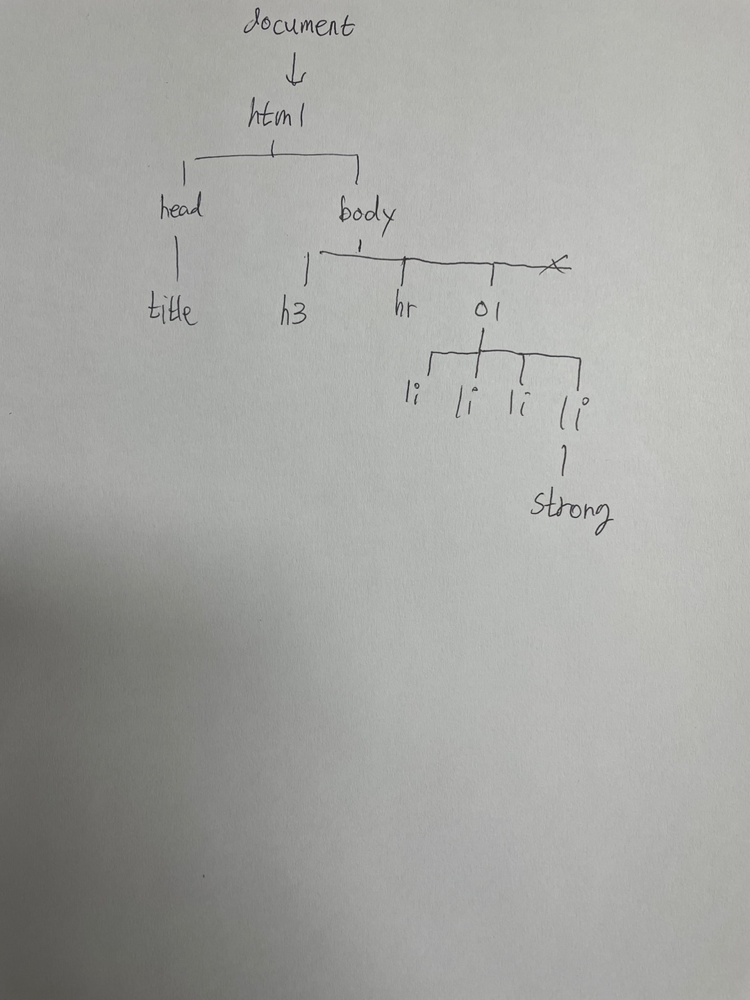
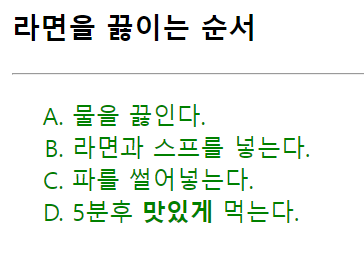
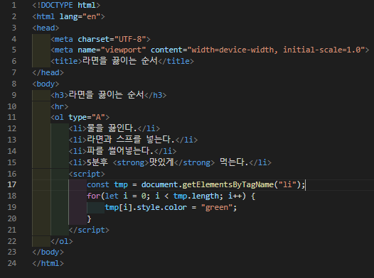
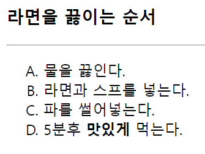
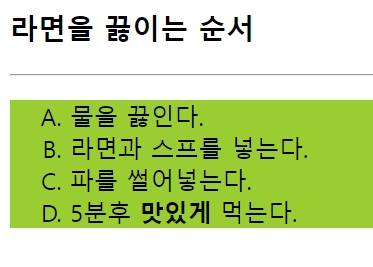
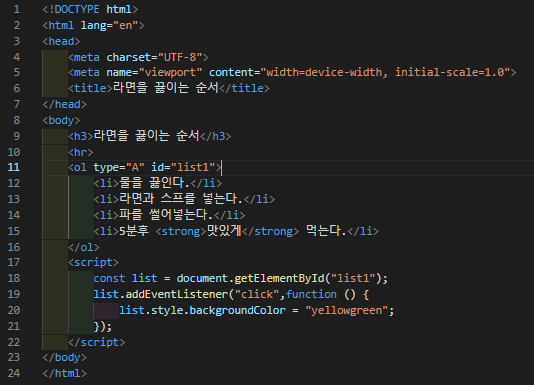

# 383 페이지 실습문제 1번 문제

-----------------------------

## 1번 문제

-----------------------------

### 스크린샷

> 해당 문제 답은 스크린샷으로 정리했습니다.

## 2번 문제

-----------------------------

### 웹페이지의 구성

> 문제에서 요구한 조건은 다음과 같습니다.

+ 자바스크립트 코드를 작성하여 모든 li태그를 찾아 글자색 변경

### 자바스크립트 작성

-----------------------------

> getElementsByTagName 함수를 통해 li태그를 찾고, 해당 태그들을 for 문을 통해 접근하여 color 프로퍼티를 green으로 설정합니다.

### 완성된 웹페이지와 코드

-----------------------------

> 다음은 완성된 웹페이지 사진과 코드 사진입니다.

## 3번 문제

-----------------------------

### 웹페이지의 구성

> 문제에서 요구한 조건은 다음과 같습니다.

+ 리스트가 출력된 공간을 클릭하면 배경색을 변경

### 자바스크립트 작성

-----------------------------

> getElementById 함수를 통해 list1 이라는 id를 가진 태그를 찾고, addEventListener 함수로 해당 태그를 클릭 시 background 프로퍼티를 yellowgreen 으로 변경합니다.

### 완성된 웹페이지와 코드

-----------------------------

> 다음은 완성된 웹페이지 사진과 코드입니다.

