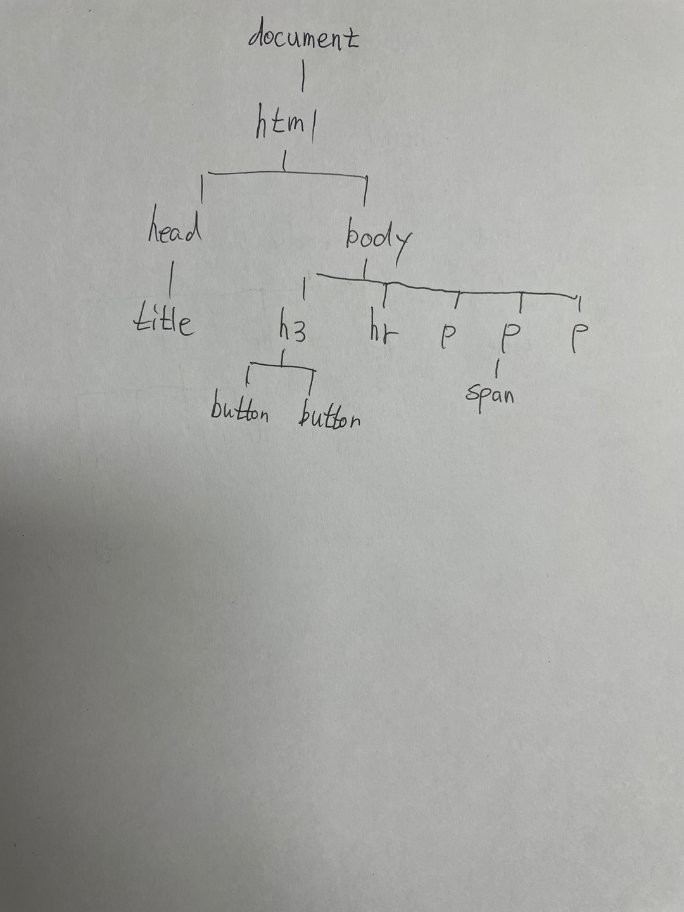
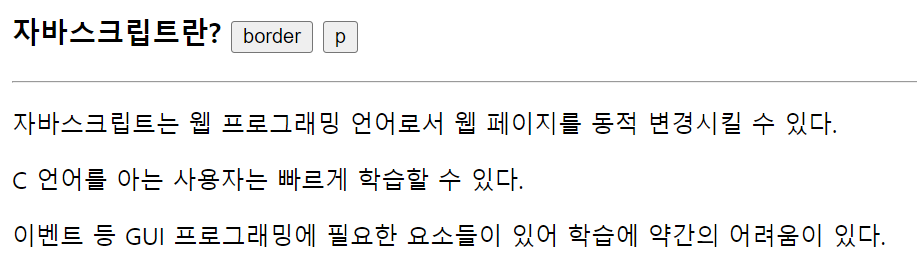
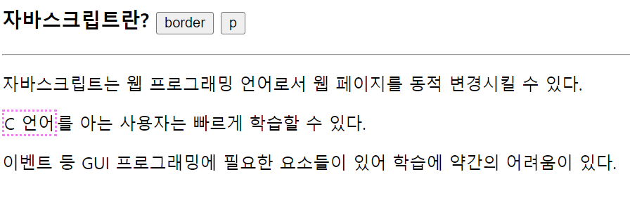
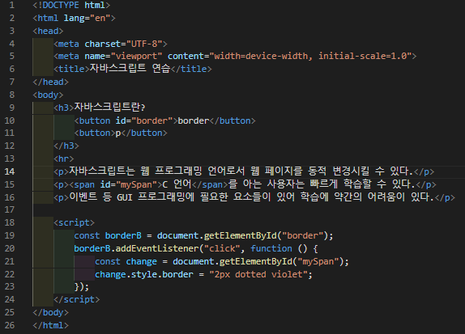
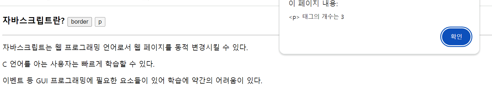
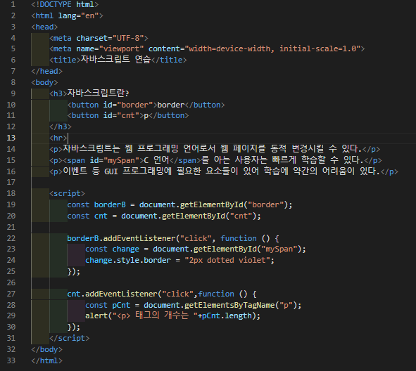

# 384 페이지 실습문제 2번 문제

-----------------------------

## 1번 문제

-----------------------------

### 스크린샷

> 해당 문제 답은 스크린샷으로 정리했습니다.

## 2번문제

-----------------------------

### 웹페이지의 구성

> 문제에서 요구한 조건은 다음과 같습니다.

+ border 버튼을 클릭하면 id가 mySpan인 span 태그에 2px violet 색 점선 테두리 생성

### 자바스크립트 작성

-----------------------------

> id가 border인 태그를 getElementById 함수를 통해 가져와서, addEventListener 함수를 통해 클릭하면, mySpan이라는 id를 가지는 태그의 border 프로퍼티를 수정하는 익명함수를 생성하여 실행하게끔 합니다.

### 완성된 웹페이지와 코드

-----------------------------

> 다음은 완성된 웹페이지 사진과 코드 사진입니다.

## 2번 문제

-----------------------------

### 웹페이지의 구성

> 문제에서 요구한 조건은 다음과 같습니다.

+ p 버튼을 클릭하면 p태그의 개수를 알림창을 통해 출력

### 자바스크립트 작성

-----------------------------

> getElementById 함수를 통해 cnt 라는 id를 가진 태그를 가져옵니다. 그리고 해당 태그를 클릭하면, addEventListener 함수를 호출하여 익명함수를 생성하여 getElementsByTagName 으로 p태그를 가져와 pCnt에 저장합니다.
    그리고, alert 함수를 통해 pCnt의 length를 출력합니다.

### 완성된 웹페이지와 코드

-----------------------------

> 다음은 완성된 웹페이지 사진과 코드 사진입니다.

