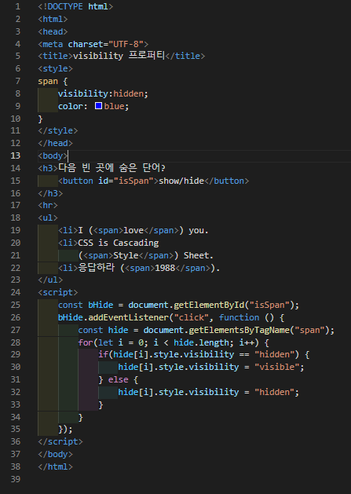
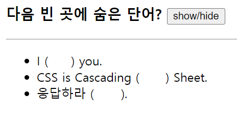
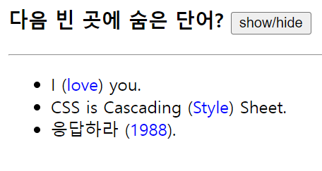

# 385 페이지 실습문제 3번 문제

-----------------------------

## 웹페이지의 구성

> 문제에서 요구한 조건은 다음과 같습니다.

+ 예제에 버튼 추가하고, 버튼 클릭 시 답 출력, 재클릭 시 답 숨김

## 자바스크립트 작성

-----------------------------

> 버튼을 클릭했을 때, 답을 가지고 있는 태그의 visibility 프로퍼티를 visible, hidden 을 번갈아가며 변경해준다.

## 완성된 웹페이지와 코드

-----------------------------

> 다음은 완성된 웹페이지 사진과 코드 사진입니다.

