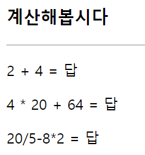

# 386 페이지 실습문제 4번 문제

-----------------------------

## 웹페이지의 구성

> 문제에서 요구한 조건은 다음과 같습니다.

+ 답을 클릭하면 계산 결과를 출력한다.

## 자바스크립트 작성

-----------------------------

> span 태그의 onclick 속성을 this.innerHTML 을 eval 함수의 결과값으로 출력합니다.

## 완성된 웹페이지와 코드

-----------------------------

> 다음은 완성된 웹페이지 사진과 코드 사진입니다.

