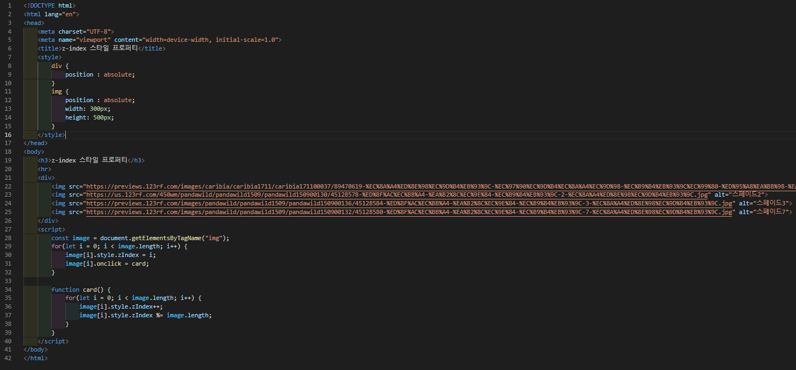
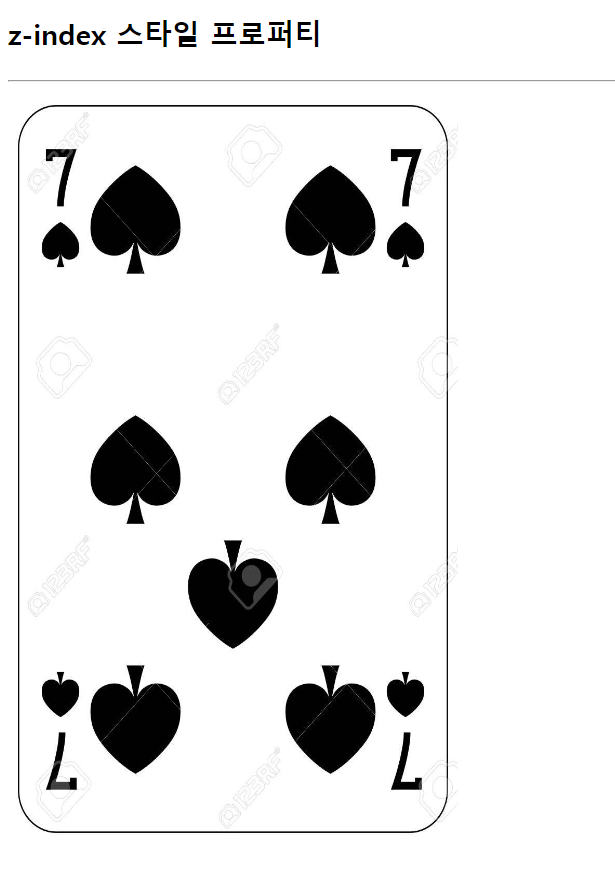
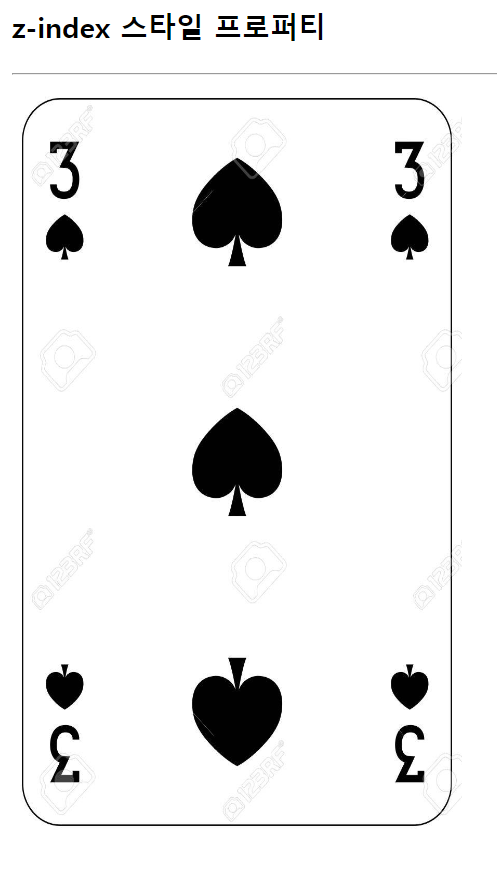

# 386 페이지 실습문제 5번 문제

-----------------------------

## 웹페이지의 구성

> 문제에서 요구한 조건은 다음과 같습니다.

+ 카드 클릭 시 클릭한 카드가 제일 아래로, 바로 아래 카드가 출력

## 자바스크립트 작성

-----------------------------

> 모든 카드 이미지를 가지는 image 배열을 만들고, zIndex 프로퍼티를 순서대로 부여합니다. 그리고, 클릭할 때 zIndex 프로퍼티를 1 증가하고, 전체 이미지 개수보다 많다면 아래로 내려가도록 모듈러 연산을 통해 아래로 내려가도록 합니다.

## 완성된 웹페이지와 코드

-----------------------------

> 다음은 완성된 웹페이지 사진과 코드 사진입니다.

