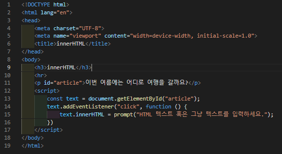
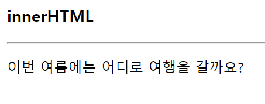
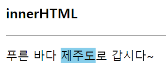

# 387 페이지 실습문제 6번 문제

-----------------------------

## 웹페이지의 구성

> 문제에서 요구한 조건은 다음과 같습니다.

+ p 태그의 텍스트를 클릭하면, 사용자로부터 입력을 받아 출력합니다.

## 자바스크립트 작성

-----------------------------

> p 태그의 텍스트를 클릭하면, prompt 함수를 통해 사용자로 부터 입력을 받고, 받은 입력을 p태그의 innerHTML 로 적용합니다.

## 완성된 웹페이지와 코드

-----------------------------

> 다음은 완성된 웹페이지 사진과 코드 사진입니다.

