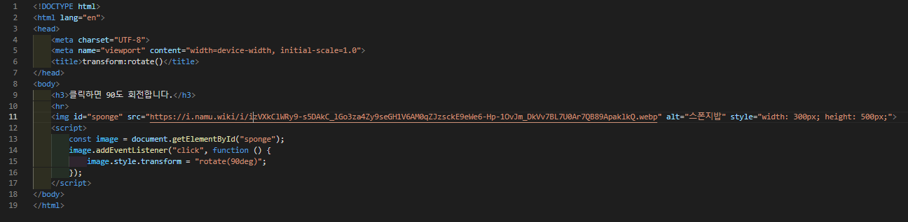
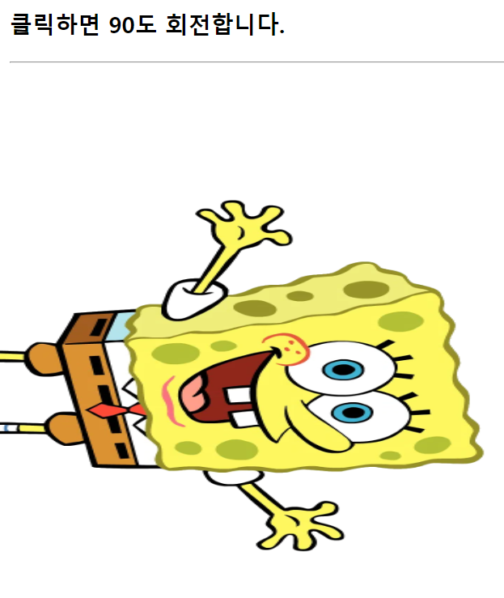
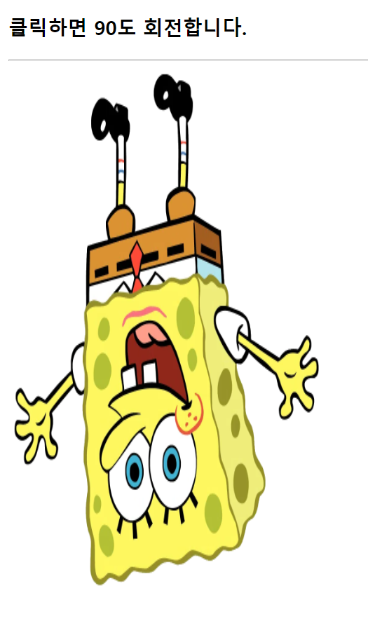
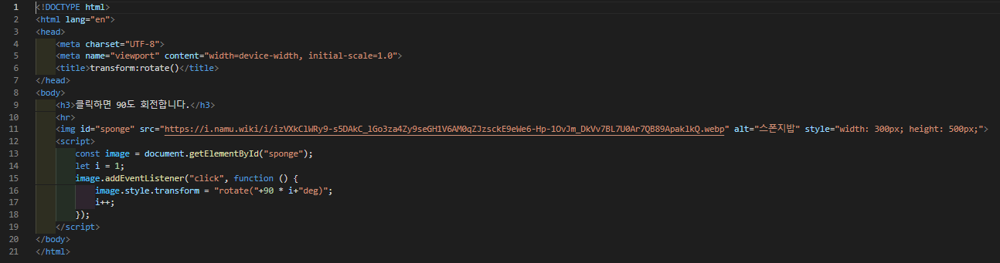

# 388 페이지 실습문제 7번 문제

-----------------------------

## 1번 문제

-----------------------------

### 웹페이지의 구성

> 문제에서 요구한 조건은 다음과 같습니다.

+ 클릭하면 한번만 90도 회전

### 자바스크립트 작성

-----------------------------

> 이미지를 클릭하게 되면, addEventListener 함수를 통해 image의 transform 프로퍼티를 rotate(90deg) 로 설정합니다.

### 완성된 웹페이지와 코드

-----------------------------

> 다음은 완성된 웹페이지 사진과 코드 사진입니다.

## 2번 문제

-----------------------------

### 웹페이지의 구성

> 문제에서 요구한 조건은 다음과 같습니다.

+ 클릭할 때 마다 90도씩 계속 회전

### 자바스크립트 작성

-----------------------------

> 클릭할 때 마다 1로 초기화해서 만든 변수 i를 통해 transform 프로퍼티를 rotate(90 * i+ "deg")로 설정하고, i를 1씩 증가합니다.

### 완성된 웹페이지와 코드

-----------------------------

> 다음은 완성된 웹페이지 사진과 코드 사진입니다.

