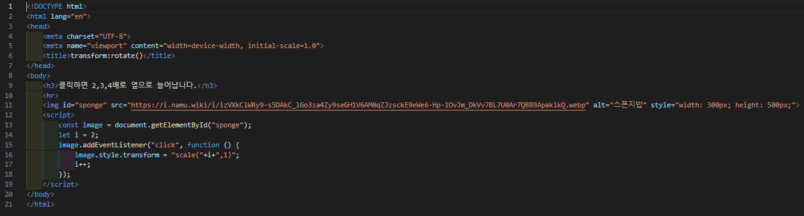

# 388 페이지 실습문제 8번 문제

-----------------------------

## 웹페이지의 구성

> 문제에서 요구한 조건은 다음과 같습니다.

+ 이미지 클릭시 2, 3, 4배로 확대

## 자바스크립트 작성

-----------------------------

> 클릭할 때 마다 2로 초기화했던 변수 i를 이용하여, transform 프로퍼티를 scale(i,1)로 설정하고, i를 1 증가합니다.

## 완성된 웹페이지와 코드

-----------------------------

> 다음은 완성된 웹페이지 사진과 코드 사진입니다.

