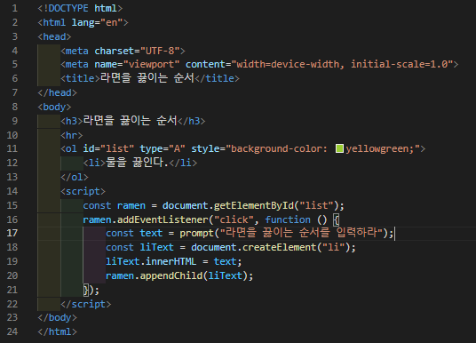
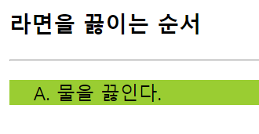
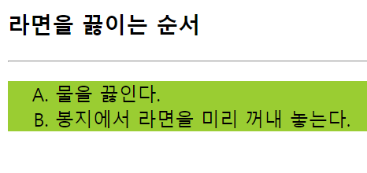

# 388 페이지 실습문제 9번 문제

-----------------------------

## 웹페이지의 구성

> 문제에서 요구한 조건은 다음과 같습니다.

+ 리스트 영역 클릭 시, li 요소 하나씩 삽입.

## 자바스크립트 작성

-----------------------------

> 리스트 영역을 클릭시, prompt 함수로 입력될 문자열을 입력받습니다. 그리고 li 태그를 createElement 함수로 생성하고 해당 태그의 innerHTML을 입력받은 문자열로 설정하고, 해당 태그를 ol 태그에 appendChild 함수로 등록합니다.

## 완성된 웹페이지와 코드

-----------------------------

> 다음은 완성된 웹페이지 사진과 코드 사진입니다.

