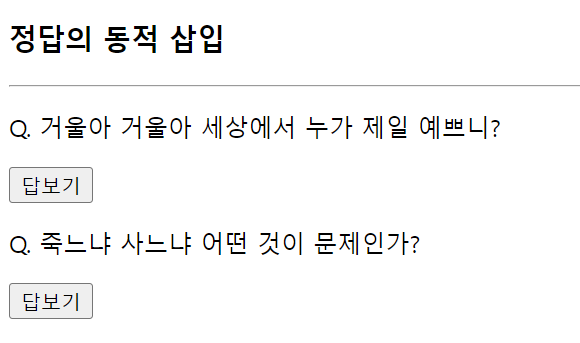

# 389 페이지 실습문제 10번 문제

-----------------------------

## 1번 문제

-----------------------------

### 웹페이지의 구성

> 문제에서 요구한 조건은 다음과 같습니다.

+ 답보기 버튼을 클릭하면 정답 p 태그를 동적으로 생성. 삽입.

### 자바스크립트 작성

-----------------------------

> 버튼을 클릭 시, addAnswer(this, "text")로 파라미터를 전송합니다. 그리고 createElement 를 통해 p태그를 만들고, 답을 innerHTML 프로퍼티에 설정한 뒤, this 로 전달받은 개체의 parentElement에 appendChild로 등록합니다.

### 완성된 웹페이지와 코드

-----------------------------

> 다음은 완성된 웹페이지 사진과 코드 사진입니다.

## 2번 문제

-----------------------------

### 웹페이지의 구성

> 문제에서 요구한 조건은 다음과 같습니다.

+ 1의 코드 수정으로 출력된 정답을 다시 클릭하면 제거.

### 자바스크립트 작성

-----------------------------

> 생성된 p 개체의 onclick 속성으로 parentElement의 removeChild 함수에 파라미터로 생성된 p 개체를 넘겨주게합니다.

### 완성된 웹페이지와 코드

-----------------------------

> 다음은 완성된 웹페이지 사진과 코드 사진입니다.

