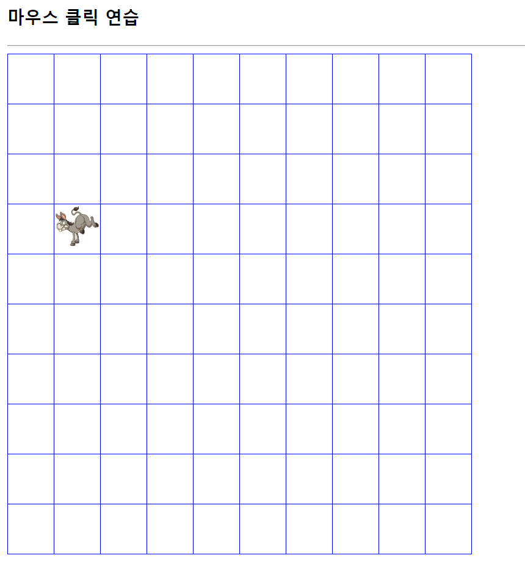
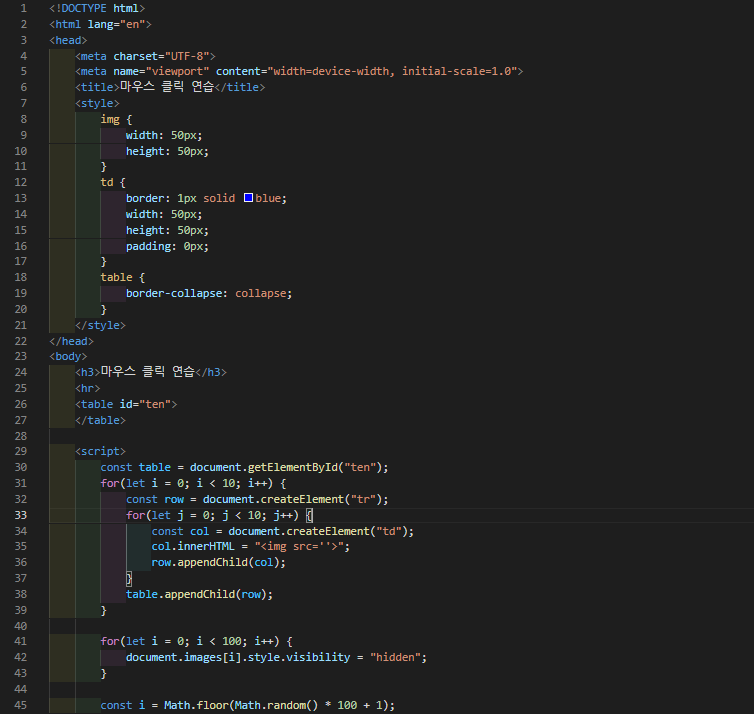
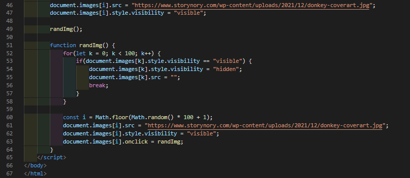

# 430 페이지 OpenChallenge 09번 문제

-----------------------------

## 웹페이지의 구성

> 문제에서 요구한 조건은 다음과 같습니다.

+ 10x10 표의 이미지를 클릭하면, 다른 셀을 랜덤하게 선택하여 이미지 출력

## 자바스크립트 작성

-----------------------------

> 먼저 10x10 표를 작성하기 위해, getElementById로 ten 이라는 id를 가진 태그를 선택하여 10번 반복하는 for문을 중첩하여 tr, td를 createElement로 만들어줍니다.
td를 만들고 각 td는 innerHTML 프로퍼티로 img 태그를 가집니다. td는 1px solid blue의 border 속성과, padding을 0, width, height를 50px로 설정합니다.
그리고 table은 border-collapse 속성을 collapse로 설정하여, 칸이 붙게끔 합니다. 모든 이미지의 visibility 속성은 hidden 으로 설정하고, randImg 함수를 호출합니다.
randImg 함수는 테이블에 visibility 속성이 visible인 이미지를 hidden으로 변경하고, 랜덤으로 셀을 선택하여 해당 셀의 visibility 속성을 visible로 설정하고 이미지 링크를 연결합니다.

## 완성된 웹페이지와 코드

-----------------------------

> 다음은 완성된 웹페이지 사진과 코드 사진입니다.

