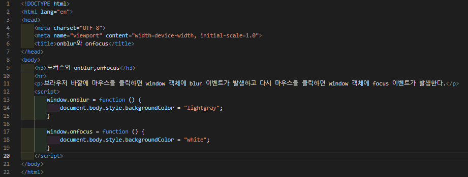
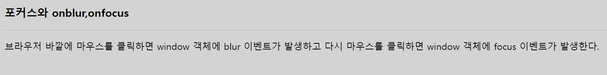

# 434 페이지 실습문제 1번 문제

-----------------------------

## 웹페이지의 구성

> 문제에서 요구한 조건은 다음과 같습니다.

+ 브라우저 내 아무곳 클릭 시 배경색 변경, 브라우저 바깥에 마우스 클릭 시 배경색 변경

## 자바스크립트 작성

-----------------------------

> 먼저 브라우저 내에서 아무곳 클릭시 배경색을 변경하기 위해 window의 onfocus의 값으로 body의 backgroundColor를 변경하는 익명함수를 설정합니다.
브라우저 바깥에 클릭시 배경색 변경은 window의 onblur의 값으로 body의 backgroundColor를 변경하는 익명함수를 설정합니다.

## 완성된 웹페이지와 코드

-----------------------------

> 다음은 완성된 웹페이지 사진과 코드 사진입니다.

