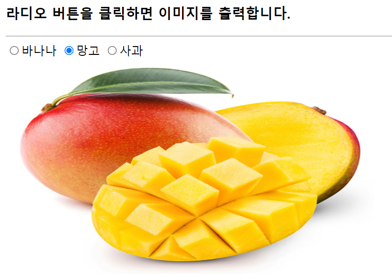
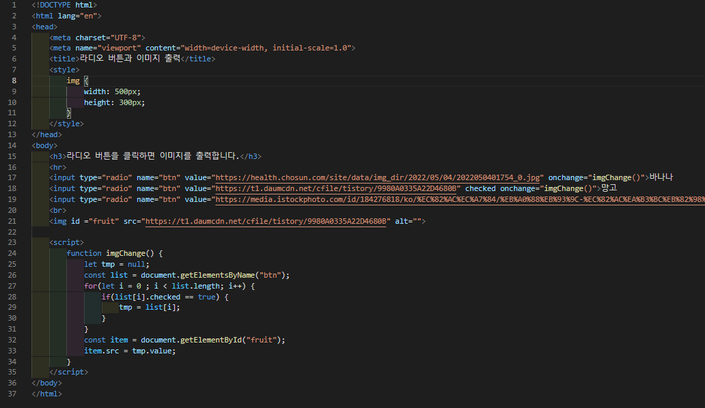

# 434 페이지 실습문제 2번 문제

-----------------------------

## 웹페이지의 구성

> 문제에서 요구한 조건은 다음과 같습니다.

+ 라디오 버튼 클릭시 이미지 교체

## 자바스크립트 작성

-----------------------------

> 각 버튼의 onchange 속성을 imgChange 함수로 설정합니다. imgChange 함수는 for문으로 버튼을 검사하며 체크가된 버튼의 value값을 이미지의 src 속성으로 설정합니다.

## 완성된 웹페이지와 코드

-----------------------------

> 다음은 완성된 웹페이지 사진과 코드 사진입니다.

