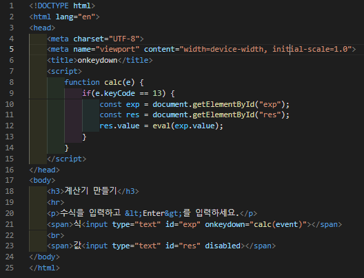
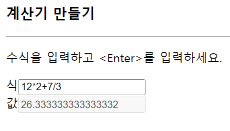

# 435 페이지 실습문제 3번 문제

-----------------------------

## 웹페이지의 구성

> 문제에서 요구한 조건은 다음과 같습니다.

+ 계산식을 입력받고 Enter 키를 입력시 결과를 출력

## 자바스크립트 코드 작성

-----------------------------

> 입력을 받는 input 태그의 onkeydown 속성으로 calc(event) 함수를 설정합니다. calc(event) 함수는 입력한 키를 calc 함수에 파라미터로 전달하는 함수로, 전달받은 키가 13(Enter) 라면, 입력한 value 값으로 eval 함수를 수행하여 결과값을 담을 input 태그의 value로 설정합니다.

## 완성된 웹페이지와 코드

-----------------------------

> 다음은 완성된 웹페이지 사진과 코드 사진입니다.

