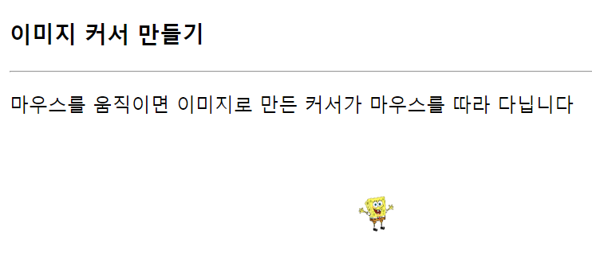
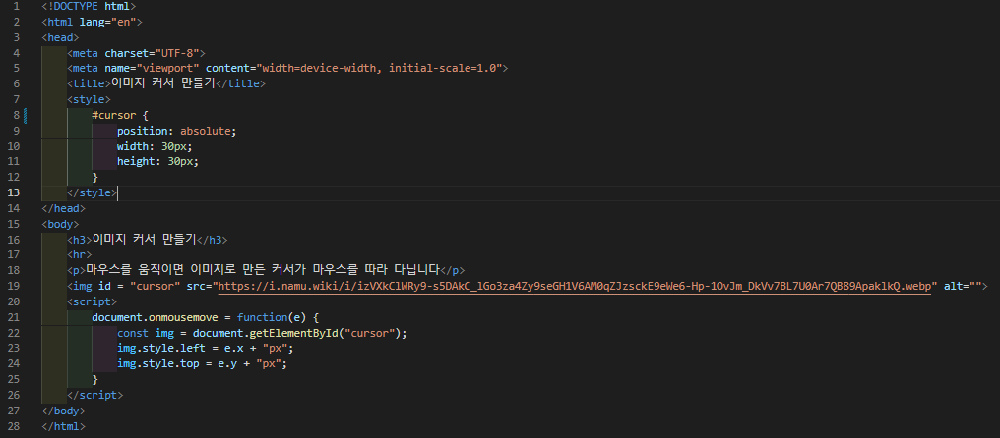

# 435 페이지 실습문제 4번 문제

-----------------------------

## 웹페이지의 구성

> 문제에서 요구한 조건은 다음과 같습니다.

+ 이미지를 마우스 커서처럼 사용하도록 설정

## 자바스크립트 작성

-----------------------------

> 먼저 이미지의 position 속성을 absolute로 설정하고, document.onmousemove의 값을 image의 left를 마우스의 x값, image의 top을 마우스의 y값으로 설정하는 익명함수로 설정합니다.

## 완성된 웹페이지와 코드

-----------------------------

> 다음은 완성된 웹페이지 사진과 코드 사진입니다.

