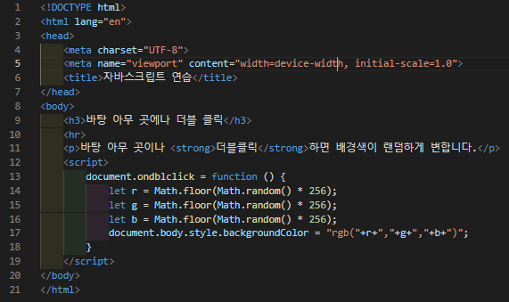

# 435 페이지 실습문제 5번 문제

-----------------------------

## 웹페이지의 구성

> 문제에서 요구한 조건은 다음과 같습니다.

+ 브라우저 아무곳이나 더블클릭 시 바탕색 랜덤변경

## 자바스크립트 작성

-----------------------------

> document.ondblclick의 값을 r,g,b 의 값을 난수로 받아 body의 backgroundColor를 설정하는 익명함수로 설정합니다.

## 완성된 웹페이지와 코드

-----------------------------

> 다음은 완성된 웹페이지 사진과 코드 사진입니다.

