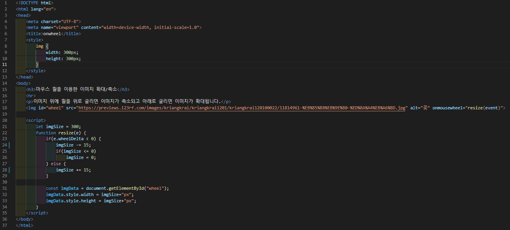
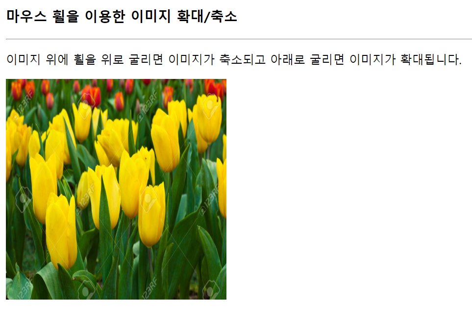

# 436 페이지 실습문제 6번 문제

-----------------------------

## 웹페이지의 구성

> 문제에서 요구한 조건은 다음과 같습니다.

+ 마우스 휠을 위로 굴리면 5% 이미지 축소, 아래로 굴리면 5% 확대

## 자바스크립트 작성

-----------------------------

> 이미지의 onmousewheel의 값을 resize(event)로 설정합니다. resize(event) 함수는 마우스 휠이 어느 방향으로 굴렀는지 값을 event로 받아 위로 굴렀다면, 5% 이미지 축소, 아래로 굴렸다면 5% 이미지 확대를 수행합니다.

## 완성된 웹페이지와 코드

-----------------------------

> 다음은 완성된 웹페이지 사진과 코드 사진입니다.

