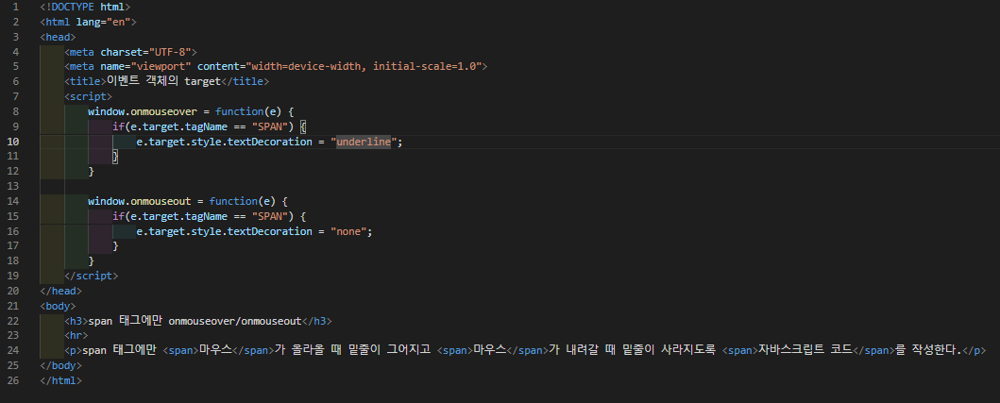
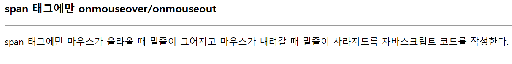

# 436 페이지 실습문제 7번 문제

-----------------------------

## 웹페이지의 구성

> 문제에서 요구한 조건은 다음과 같습니다.

+ 모든 span 태그는 마우스가 올라오면 밑줄을 긋고, 마우스가 나가면 밑줄을 지운다.

## 자바스크립트 작성

-----------------------------

> window에서 onmouseover 이벤트와 onmouseout 이벤트가 발생했을 때, 각각 발생한 이벤트의 태그가 SPAN인지 확인하고 맞다면, span 태그의 textDecoration 속성을 none, underline 으로 설정한다.

## 완성된 웹페이지와 코드

-----------------------------

> 다음은 완성된 웹페이지 사진과 코드 사진입니다.

