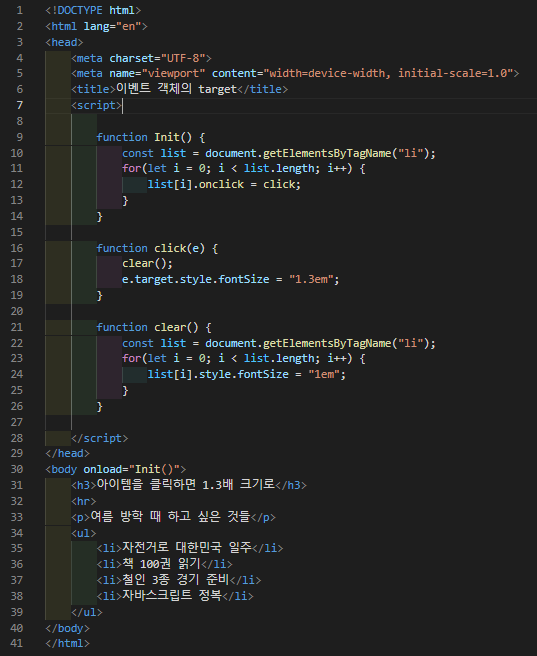
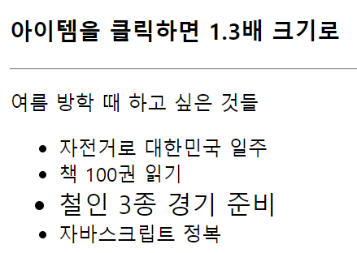

# 437 페이지 실습문제 8번 문제

-----------------------------

## 웹페이지의 구성

> 문제에서 요구한 조건은 다음과 같습니다.

+ li 아이템 클릭시 1.3em 설정, 다른 아이템 클릭시 이전 아이템 1.0em 설정

## 자바스크립트 작성

-----------------------------

> 먼저 작성된 모든 li의 onclick 속성의 값을 click()로 설정합니다. click 함수는 clear함수를 호출하고, fontSize를 1.3em으로 설정합니다. clear 함수는 모든 li 아이템의 fontSize를 1.0em으로 설정합니다.

## 완성된 웹페이지와 코드

-----------------------------

> 다음은 완성된 웹페이지 사진과 코드 사진입니다.

