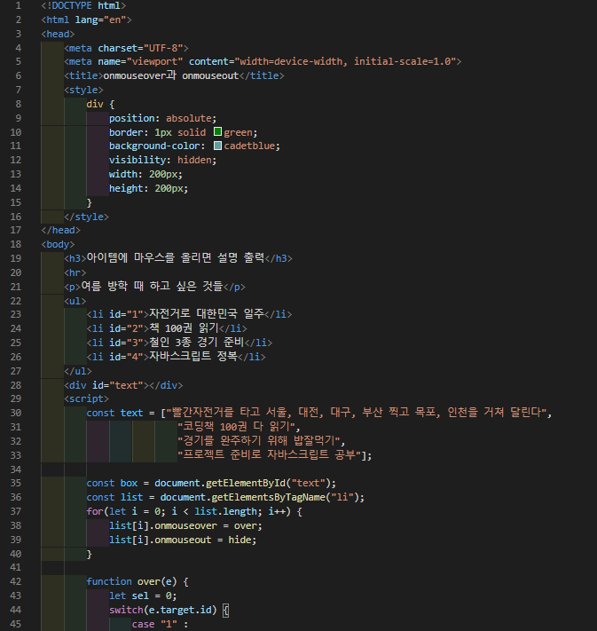
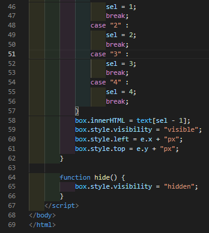
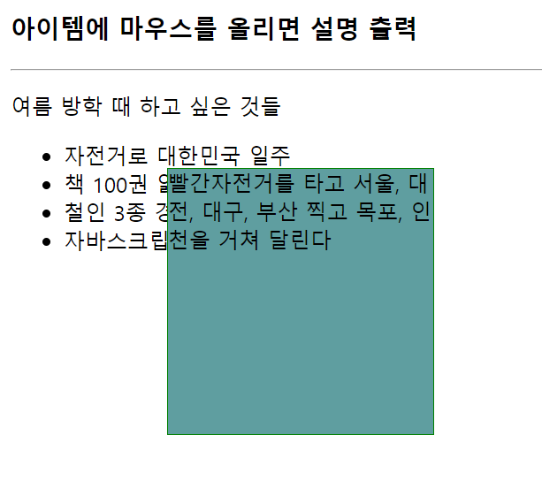

# 437 페이지 실습문제 9번 문제

-----------------------------

## 웹페이지의 구성

> 문제에서 요구한 조건은 다음과 같습니다.

+ 리스트 아이템 영역에 마우스가 들어오면 상세 설명 출력

## 자바스크립트 작성

-----------------------------

> 모든 li 아이템에 대해 onmouseover 는 over 함수를 호출하고, onmouseout은 hide 함수를 호출하게 합니다. over 함수는 발생한 이벤트의 id값을 switch case 문으로 판별하여 해당 id값에 맞는 설명문의 visibility 속성을 visible로 설정합니다.
그리고 해당 설명문의 left는 마우스의 x, top은 마우스의 y로 설정하여 마우스가 들어온 위치에 보이게끔합니다. hide의 경우 visibility 속성을 hidden 으로 설정합니다.

## 완성된 웹페이지와 코드

-----------------------------

> 다음은 완성된 웹페이지 사진과 코드 사진입니다.

