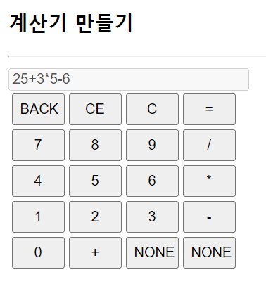
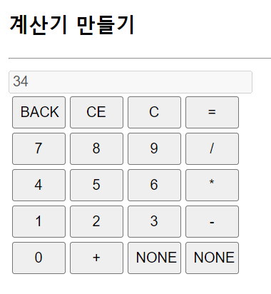
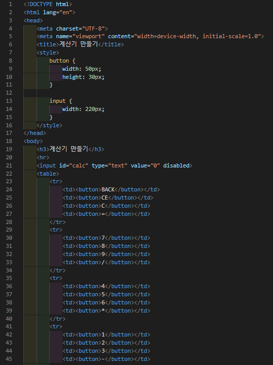
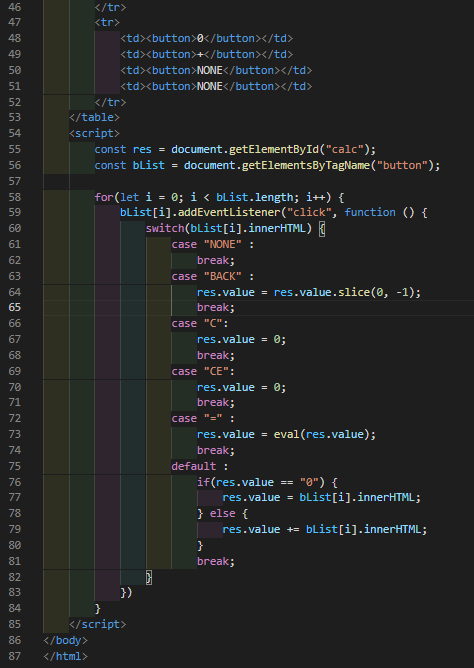

# 438 페이지 실습문제 10번 문제

-----------------------------

## 웹페이지의 구성

> 문제에서 요구한 조건은 다음과 같습니다.

+ 버튼을 눌러 계산식을 만들고 = 버튼으로 계산결과 출력하는 계산기 생성
+ BACK 버튼은 마지막 문자 삭제, CE, C 버튼은 입력창 내용을 모두 지우고 0출력

## 자바스크립트 작성

-----------------------------

> switch case를 통해 입력한 버튼의 innerHTML을 검사합니다. 0~9 버튼이 입력될 경우 입력창에 값이 0인지 아닌지 판별하여 0이라면, 바로 버튼의 innerHTML 값을 입력, 아니라면, 입력창의 value의 뒤에 버튼의 innerHTML 값을 붙입니다.
BACK 버튼이 입력됐다면, 입력창의 value를 slick(0, -1)을 통해 마지막 문자를 삭제하여 입력창 value로 설정합니다. C나 CE가 입력되면 입력창의 value를 0으로 설정합니다. = 가 입력됐다면, 입력창의 value를 입력창 value 값으로 eval 함수를 실행한 결과로 설정합니다.

## 완성된 웹페이지와 코드

-----------------------------

> 다음은 완성된 웹페이지 사진과 코드 사진입니다.

