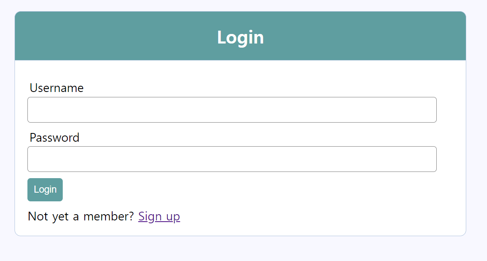
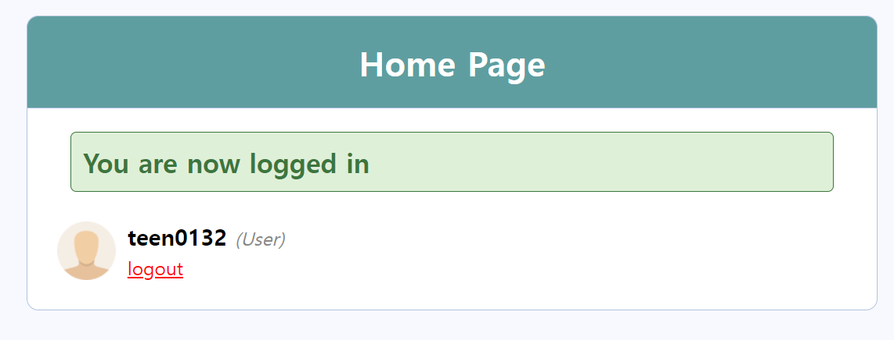
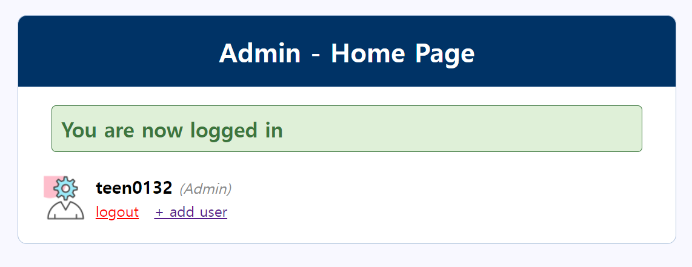
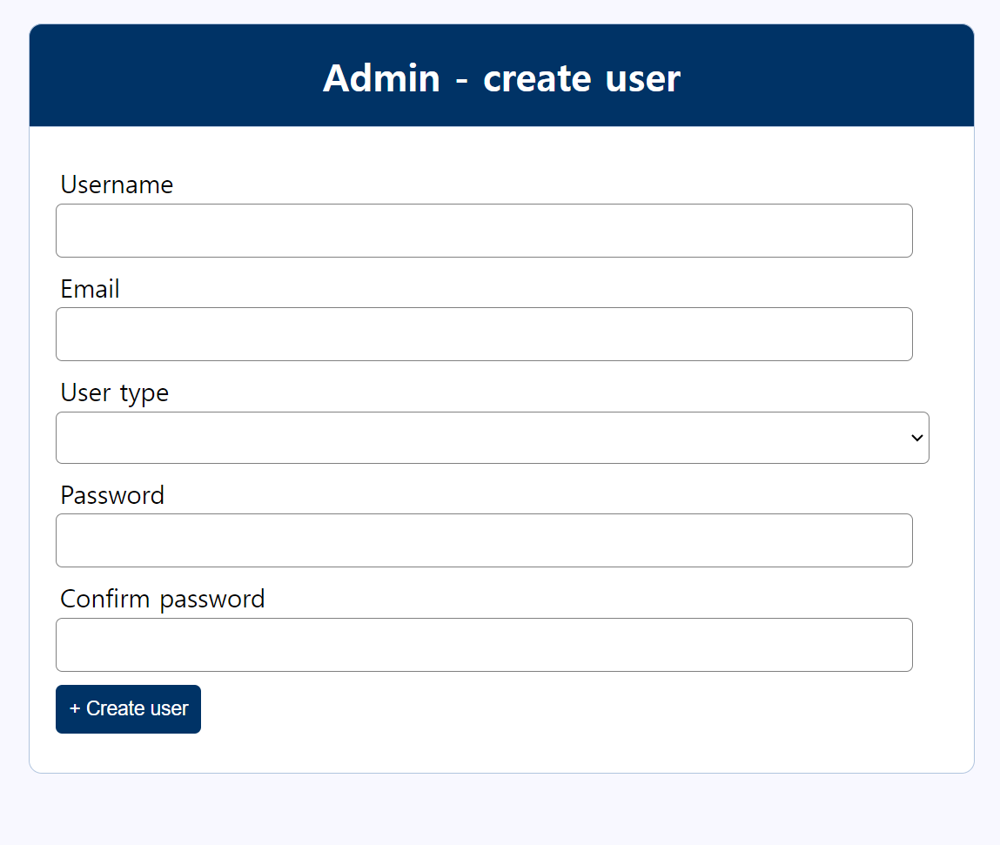

# 11/27 로그인 구현

## 로그인 화면

> Username과 password를 입력하고 Login 버튼을 누르면, function.php에서 유효한지 검사를 거친 후, 유저가 있다면 로그인 처리를 수행합니다.

### 로그인 유지

> 로그인 후 로그인이 유지가 되고, 값의 변경이 가능한 이유는 서버의 세션에 값들을 저장해두고, 서버 사이드에서 정적 웹페이지를 생성해서 보내기 때문에,
> 로그인 로그아웃이 유지 및 변경이 가능해집니다. (쿠키를 사용하여 값의 변경, 유지 또한 가능합니다.)

> 아래는 로그인이 완료 된 경우입니다.

## 회원가입

> 회원가입 또한 로그인과 같이 값이 입력되고 Register 버튼을 누르면, 값들이 다 유효한지 function.php에서 검사한 후, 데이터베이스에 값을 삽입하고 로그인 화면으로 돌아갑니다.

## Function.php 분석

> 먼저 session_start()를 통해 세션을 생성합니다.
> db 변수에 사용자가 사용할 데이터베이스를 연동시킵니다.
> 출력할 때 사용할 username과 email, error를 저장하기 위한 변수를 생성합니다.
> POST 요청이 register btn에 의해 들어왔는지 확인하고, 참이라면, register() 를 실행합니다.

### register()

> db에서 가져온 값을 저장하기 위한 변수들을 생성합니다.
> POST로 받은 값들을 저장하는데, 이때, XSS 공격을 방지하기 위해 escape 함수를 사용합니다. (XSS 공격이란, 악의적으로 입력하는 공간에 JAVASCRIPT 내용을 입력하거나, SQL문을 작성하여 내부의 값을 빼내는 것을 말합니다.)
> 각 값들이 정상적으로 가져와졌는지 검사하고 user_type의 값에 따라 db에 값들을 삽입합니다.
> 이때, 비밀번호는 md5 해싱법으로 암호화하여 삽입합니다. 
> success 세션에 값을 입력하고, user_type 값의 유무에 따라 home.php 혹은 index.php로 이동합니다.

### getUserById($id)

> 파라미터로 받은 id값으로 db에서 검색해 일치하는 유저이름을 반환하는 함수입니다.

### e($val)

> escape 함수입니다.

### display_error()

> 에러가 발생한 경우, 에러들을 저장한 변수의 값들을 div 태그안에 묶어 출력합니다.

### isLoggedIn() 

> user 세션에 값이 있다면, true. 반대라면 false를 출력합니다.

### 로그아웃

> logout버튼으로 GET 요청이 들어왔다면, 세션을 삭제하고 user 세션의 값을 삭제합니다. 그리고 페이지를 login.php로 이동합니다.

### 로그인

> 로그인 버튼을 통해 POST 요청이 들어왔다면, login() 을 호출합니다.

### login()

> 요청으로 받은 id, pwd를 저장할 변수를 생성합니다.
> 정상적으로 입력됐는지 확인하고, db에서 일치하는 값이 있는지 확인 후, 연관 배열로 저장합니다.
> 이떄, user_type을 검사하여, admin이라면 user 세션에 연관 배열에서 가져온 값을 저장합니다.
> 그리고, admin/home.php로 이동합니다. (일반 유저라면 index.php로 이동합니다.)
> 일치하는 값이 없었다면, 에러 내용을 저장합니다.

### isAdmin()

> user 세션에 값이 있고, user세션의 user_type 값이 admin이라면, true를, 아니라면 false를 반환합니다.

## 회원가입 확인

> 회원가입이 정상적으로 확인됐는지 체크하기 위한 데이터베이스 사진입니다.

> id값은 primary key로 unique key입니다. Auto increasement로 회원가입 될 때마다 1씩 증가합니다.
> username과 email은 입력받은대로 삽입되고, user_type은 기본적으로 user 로 저장되지만, 임의로 admin으로 바꾸어 admin 처리를 수행할 수 있습니다.
> password는 md5 해쉬로 암호화되어 저장된것을 확인할 수 있습니다.

## 어드민 페이지

> 어드민 계정으로 로그인 하면 다음과 같이 admin/home.php 로 이동합니다.

> add user를 통해, admin 혹은 user를 생성할 수 있습니다.

